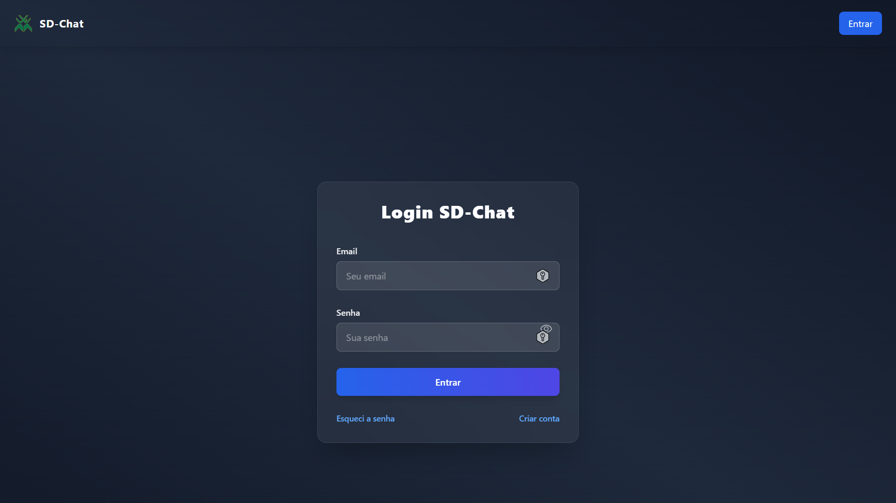
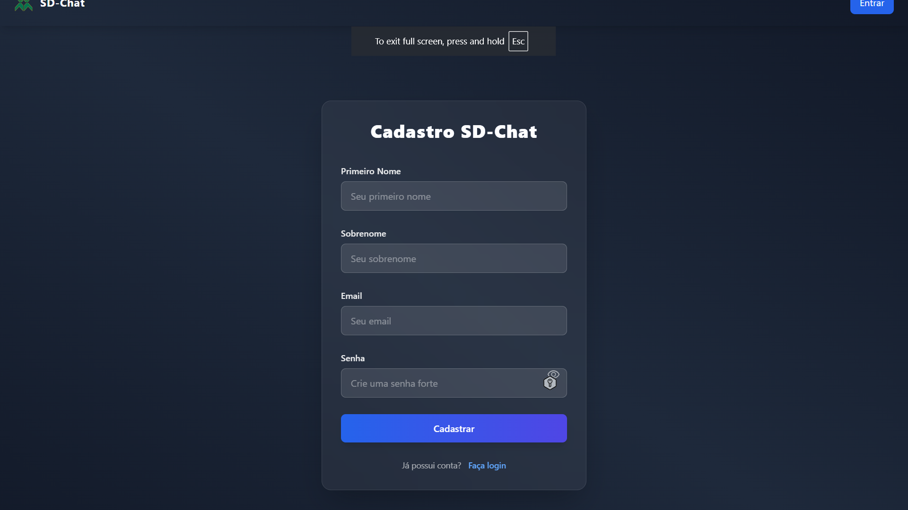
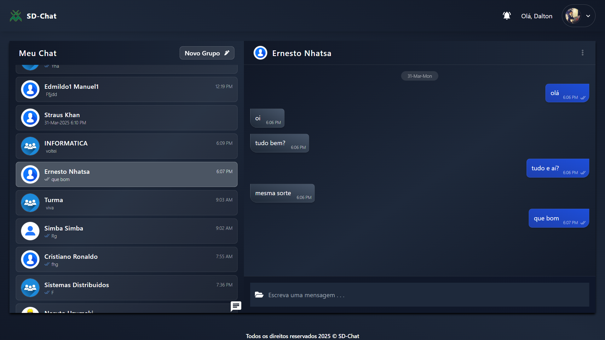
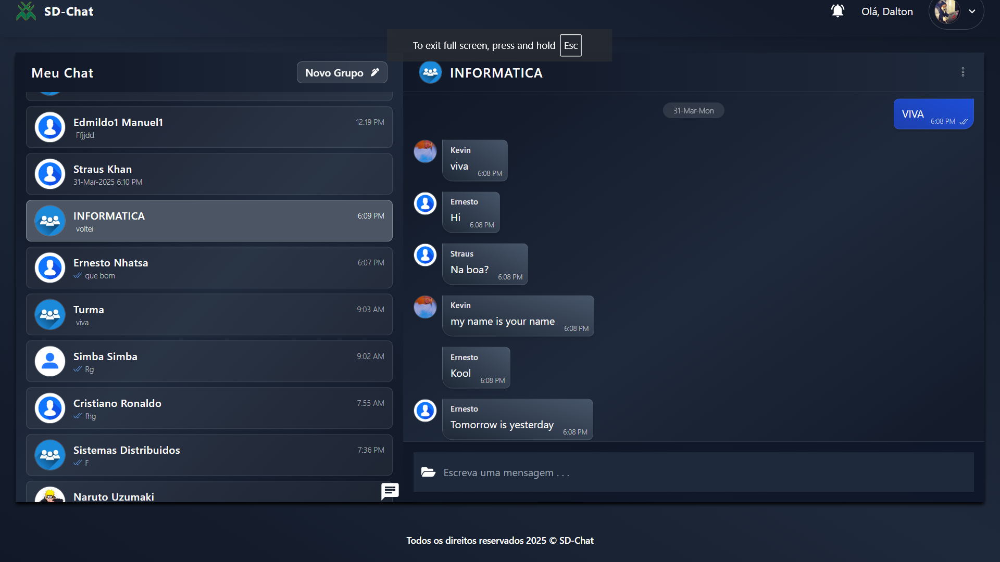
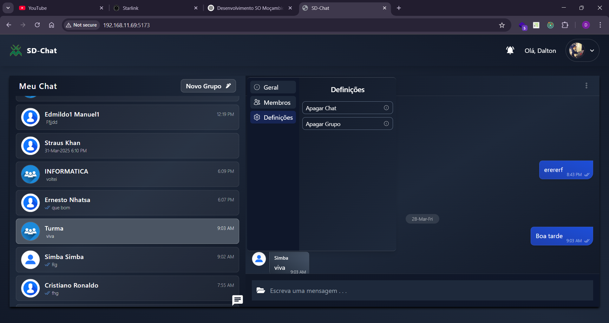
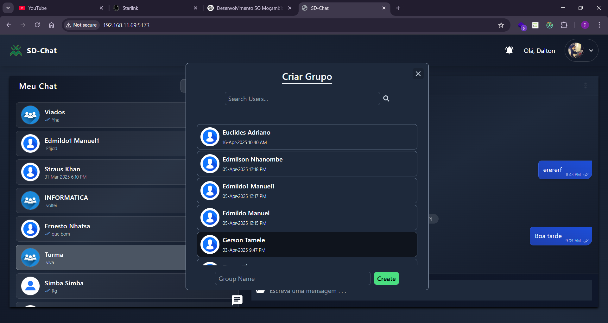

# Chat Application - Aplicação Web MERN-Stack

<p align="center">
  <b style="color: blue;">Contador de Visitantes</b>
  <br>
  <a href="https://github.com/DaltonChivambo/SD_CHAT_APP">
    
  </a>
</p>

## Visão Geral do Projeto

Uma aplicação de chat em tempo real construída usando a stack MERN (MongoDB, Express, React, Node.js) e estilizada com Tailwind CSS. A aplicação suporta autenticação de usuários, chats em grupo e mensagens instantâneas com atualizações em tempo real via Socket.IO.

## Funcionalidades

### 1. Autenticação e Gerenciamento de Usuários
- **Registro e Login**: Sistema completo de autenticação de usuários
- **Perfil de Usuário**: Gerenciamento de informações pessoais
- **Segurança**: Proteção de rotas e dados com JWT (JSON Web Tokens)

### 2. Chat Privado
- **Conversas 1-1**: Chat privado entre dois usuários
- **Histórico de Mensagens**: Armazenamento e recuperação de mensagens anteriores
- **Notificações em Tempo Real**: Alertas instantâneos de novas mensagens

### 3. Grupos de Chat
- **Criação de Grupos**: Capacidade de criar grupos com múltiplos usuários
- **Administração de Grupos**: 
  - Adicionar/remover membros
  - Renomear grupos
  - Configurações de administrador
- **Chat em Grupo**: Comunicação em tempo real entre todos os membros

### 4. Gerenciamento de Conversas
- **Limpar Chat**: Opção para apagar todo o histórico de mensagens
- **Excluir Chat**: Remover conversas individuais ou grupos
- **Busca de Usuários**: Sistema de busca para encontrar e adicionar novos contatos

### 5. Interface e Experiência do Usuário
- **Design Responsivo**: Interface adaptável para diferentes dispositivos
- **Indicador de Digitação**: Mostra quando outros usuários estão digitando
- **Notificações Toast**: Alertas visuais para ações importantes
- **Tema Escuro**: Interface com tema escuro para melhor experiência visual

### 6. Recursos Técnicos
- **Comunicação em Tempo Real**: Implementação com Socket.IO
- **Gerenciamento de Estado**: Utilização do Redux para controle de estado
- **Persistência de Dados**: Armazenamento em MongoDB
- **API RESTful**: Backend estruturado com Express.js

## Tecnologias Utilizadas

- **MongoDB**: Banco de dados NoSQL para armazenamento flexível e escalável
- **Express.js**: Framework web para Node.js
- **Node.js**: Ambiente de execução JavaScript no servidor
- **React.js**: Biblioteca JavaScript para construção de interfaces de usuário
- **Tailwind CSS**: Framework CSS para desenvolvimento rápido de interfaces
- **Socket.IO**: Permite comunicação bidirecional em tempo real
- **JWT (JSON Web Tokens)**: Para autenticação segura
- **Redux**: Gerenciamento de estado da aplicação
- **React-Toastify**: Biblioteca para notificações toast

## Como Instalar e Executar

1. **Clone o Repositório:**
   ```bash
   git clone https://github.com/DaltonChivambo/SD_CHAT_APP.git
   cd SD_CHAT_APP
   ```

2. **Instale as Dependências:**
   Para o Frontend:
   ```bash
   cd frontend
   npm install
   ```

   Para o Backend:
   ```bash
   cd backend
   npm install
   ```

3. **Configure as Variáveis de Ambiente:**
   No Frontend, crie um arquivo `.env`:
   ```
   VITE_BACKEND_URL=http://localhost:9000
   ```

   No Backend, crie um arquivo `.env`:
   ```
   FRONTEND_URL=http://localhost:5173
   MONGODB_URI=mongodb://127.0.0.1:27017/chat-app
   PORT=9000
   JWT_SECRET=sua-chave-secreta
   ```

4. **Execute a Aplicação:**
   Frontend:
   ```bash
   npm run dev
   ```

   Backend:
   ```bash
   npm run dev
   ```

5. **Acesse a Aplicação:**
   Abra `http://localhost:5173` no seu navegador

## Screenshots da Aplicação

### Tela de Login

Interface de login da aplicação.

### Tela de Registro

Página para criação de nova conta.

### Conversa Privada

Interface de chat privado entre usuários.

### Conversa em Grupo

Interface de chat em grupo.

### Configurações do Grupo

Configurações e opções do grupo.

### Criar Novo Grupo

Interface para criação de novos grupos.

## Estrutura do Projeto

```
├── frontend
│   ├── public
│   ├── src
│   │   ├── assets
│   │   ├── components
│   │   ├── pages
│   │   ├── redux
│   │   ├── socket
│   │   ├── utils
│   │   ├── App.jsx
│   │   ├── main.jsx
│   │   └── index.css
│   ├── index.html
│   ├── tailwind.config.js
│   ├── .env
│   └── package.json
├── backend
│   ├── config
│   ├── controllers
│   ├── middlewares
│   ├── models
│   ├── routes
│   ├── server.js
│   ├── .env
│   └── package.json
└── README.md
```

## Recursos Principais

- Autenticação de usuários (login/registro)
- Chat em tempo real
- Chats em grupo
- Notificações de mensagens
- Interface responsiva
- Gerenciamento de estado com Redux
- Comunicação em tempo real com Socket.IO

## Autor

Dalton Chivambo \
GitHub: [@DaltonChivambo](https://github.com/DaltonChivambo) \

## Agradecimentos

Obrigado por explorar o Chat App! Seu feedback é valioso. Se tiver alguma sugestão ou pensamento, sinta-se à vontade para compartilhar. 😊

## Logs do Sistema

### 1. Logs de Autenticação
- **Registro de Usuário**: Log detalhado de novos registros com timestamp
- **Login/Logout**: Registro de tentativas de login e logout
- **Falhas de Autenticação**: Log de tentativas falhas de login

### 2. Logs de Mensagens
- **Envio de Mensagens**: 
  - Registro de mensagens enviadas com timestamp
  - Identificação do remetente e destinatário
  - Status de entrega da mensagem
- **Recebimento de Mensagens**:
  - Log de mensagens recebidas
  - Confirmação de leitura
  - Status de visualização

### 3. Logs de Grupos
- **Criação de Grupos**:
  - Registro do criador do grupo
  - Lista de membros iniciais
  - Timestamp de criação
- **Modificações em Grupos**:
  - Log de adição/remoção de membros
  - Alterações de nome do grupo
  - Mudanças de administrador
- **Exclusão de Grupos**:
  - Registro de grupos excluídos
  - Usuário que realizou a exclusão
  - Timestamp da exclusão

### 4. Logs de Sistema
- **Conexões Socket.IO**:
  - Registro de conexões estabelecidas
  - Desconexões de usuários
  - Endereços IP dos clientes
- **Erros do Sistema**:
  - Log de erros de conexão
  - Falhas de autenticação
  - Problemas de banco de dados
- **Ações Administrativas**:
  - Registro de ações de administradores
  - Modificações em configurações
  - Acessos privilegiados

### 5. Logs de Performance
- **Tempo de Resposta**:
  - Log de latência das requisições
  - Tempo de processamento
  - Uso de recursos
- **Uso de Memória**:
  - Monitoramento de uso de memória
  - Alocação de recursos
  - Limpeza de cache

### 6. Logs de Segurança
- **Tentativas de Acesso**:
  - Registro de tentativas de acesso
